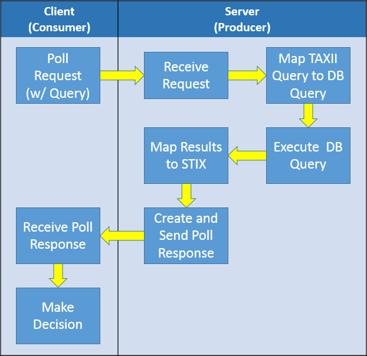

A File Hash Reputation Service allows requesters to specify a File Hash and receive a confidence assertion about whether 
that File Hash indicates a malicious file - or, how confident the information provider is that the file identified by that 
File Hash is malicious. This example
uses TAXII Query to convey the request for information based on a File Hash, and uses STIX to represent the
result. All code examples use [libtaxii](/developers/libtaxii/) and 
[python-stix](http://stix.readthedocs.org/en/latest/), two publicly available libraries.

This TAXII Service Profile demonstrates the production and consumption of TAXII Messages, as well as the 
creation and delivery of STIX content. 
This TAXII Service Profile does not demonstrate transmitting TAXII Messages across a network.
 
This documentation is from the perspective of the TAXII Server, called "service provider" in this documentation.

## Requirements
These are the requirements to implement a File Hash Reputation Service as described in this TAXII Service Profile:

1. Implement a Poll Service that supports TAXII Default Query
1. Have a Data Collection named `file_hash_reputation`

 1. This Data Collection is a Data Set (as opposed to a Data Feed)

1. Have a database that (nominally) contains the following information: 

 1. File Hash (The MD5 hash of the file)
 1. Confidence (The confidence that the file is malicious - High, Medium, Low, None, or Unknown)

1. Use STIX as the Targeting Expression Vocabulary
1. Service provider name. This example uses "Mark's Malware Metadata Mart"

For the sake of this example, we'll assume that the table containing File Hash and Confidence is
a SQL Table that looks like the table below. The table is named `file_hash_reputation`.

| md5_hash                             | confidence |
|--------------------------------------|------------|
| AAAAAAAAAAAAAAAAAAAAAAAAAAAAAAAA     | Low        |
| BBBBBBBBBBBBBBBBBBBBBBBBBBBBBBBB     | Medium     |
| CCCCCCCCCCCCCCCCCCCCCCCCCCCCCCCC     | High       |

## STIXification
When using STIX, there are factors that should be considered beyond just the data that will be represented. These factors include at a minimum mapping your data to STIX and [STIX Versioning](http://stixproject.github.io/documentation/concepts/versioning/). This section describes the "STIXification" of the above database.
The STIXified version of `file_hash_reputation` is `file_hash_reputation_stixified`.

#### Mapping
An important step is mapping the source information to STIX. The [STIX Documentation] (http://stixproject.github.io/documentation/) provides guidance for this process; the idioms may be of particular interest. A few high-level decisions are important to highlight:

* An Indicator with a File Object Observable will hold the File Hash
* The Indicator will have an Indicated TTP (tactics, techniques, and procedures)
* The Indicated TTP will be "Malicious File"
* A Confidence relationship between the Indicator and the Indicated TTP will assert how confident the provider, "Mark's Malware Metadata Mart", is that the file is malicious
  * The confidence value will be one of High, Medium, Low, None, or Unknown.

#### Versioning
In addition to MD5 Hash and Confidence, an implementation needs to keep track of certain versioning information. This information includes ID and timestamp for the Indicator and
TTP constructs, the ID for the Observable and Object constructs, and the timestamp for the Confidence assertion.

For this example File Hash Reputation implementation, there are certain values that can be "hard coded". Those values are:

* id namespace = "urn:example.com:marks_malware_metadata_mart"
* id namespace alias = "m4"
* TTP ID: `ttp-d539bb85-9363-4814-83c8-fa9975045686`
* TTP Timestamp: `2014-09-30T15:56:27.000000+00:00`

Other values will be different for each file hash. Those values are described in the following table:

| md5_hash                             | object_id (local part)                    | observable_id (local part)                      |  confidence | confidence_timestamp        | indicator_id (local part)                       | indicator_timestamp        | 
|--------------------------------------|-------------------------------------------|-------------------------------------------------|-------------|-----------------------------|-------------------------------------------------|----------------------------| 
| AAAAAAAAAAAAAAAAAAAAAAAAAAAAAAAA     | File-927731f2-cc2c-421c-a40e-dc6f4a6c75a4 | Observable-45e3e64c-8438-441e-bc49-51e417466e29 |    High     | 2014-09-29T14:32:00.000000  | Indicator-54baefc1-4742-4b40-ba83-afd51115015b  | 2014-09-29T14:32:00.000000 | 

### STIXification - Conclusion
A tabular view of the mapping decisions: 

| database field       | STIX Construct                                                       |
|----------------------|----------------------------------------------------------------------|
| md5_hash             | Indicator\Observable\Object\Properties\Hashes\Hash\Simple_Hash_Value |
| object_id            | Indicator\Observable\Object\@id                                      |
| observable_id        | Indicator\Observable\@id                                             |
| confidence           | Indicator\Indicated_TTP\Confidence\Value                             |
| confidence_timestamp | Indicator\Indicated_TTP\Confidence\@timestamp                        |
| indicator_id         | Indicator\@id                                                        |
| indicator_timestamp  | Indicator\@timestamp                                                 |

Converting the database into a STIXified version will help greatly with future steps. One thing that should be noted is that the `file_hash_reputation_stixified` database table only supports the File Hash Reputation use case. Supporting additional use cases would likely result in a refactor/rearchitecture of the database.

## Workflow
The workflow for this Service Profile is:
 
1. [**Discovery:**](#1) The client requests a list of services provided by the server. The server responds with a list of available services, including the File Hash Reputation Service.
1. [**Poll Request:**](#2) The service provider receives a Poll Request with a TAXII Default Query indicating the File Hash to be checked.
1. [**Inbound Mapping:**](#3) The service provider maps the TAXII Default Query into a query for the 
service provider's database
1. [**Database Query:**](#4) The service provider executes the query against the service provider's database
1. [**Outbound Mapping:**](#5) The service provider maps the database result set into STIX
1. [**Poll Response:**](#6) The service provider packages up the STIX into a Poll Response and return it
1. [**Parse Response**](#7) The recipient of information parses the response

### Step 1 - Discovery
The service provider receives a Discovery Request and responds with a Discovery Response that details
the service provider's capabilities.

#### Discovery Request
The Discovery Request sent to the service provider to discover capabilities.
 
[XML Source](file-hash-rep-discovery-request.xml)

<taxii_11:Discovery_Request  
    xmlns:taxii_11="http://taxii.mitre.org/messages/taxii_xml_binding-1.1" 
    message_id="1"/>


[Python Source](file-hash-rep-discovery-request.py)

import libtaxii.messages_11 as tm11
dr = tm11.DiscoveryRequest(message_id="1")
print dr.to_xml(pretty_print=True)


#### Discovery Response
The Discovery Response sent by the service provider detailing capabilities. In this example, the response indicates that the poll service supports TAXII default query language queries of STIX 1.1.1 targets with a preferred scope of **\*\*/Simple_Hash_Value**; this is the XPath location in the STIX Package that the service covers.

[XML Source](file-hash-rep-discovery-response.xml)

<taxii_11:Discovery_Response 
    xmlns:taxii_11="http://taxii.mitre.org/messages/taxii_xml_binding-1.1" 
    xmlns:tdq="http://taxii.mitre.org/query/taxii_default_query-1" 
    message_id="25984" 
    in_response_to="1">
  <taxii_11:Service_Instance service_type="POLL" service_version="urn:taxii.mitre.org:services:1.1" available="true">
    <taxii_11:Protocol_Binding>urn:taxii.mitre.org:protocol:http:1.0</taxii_11:Protocol_Binding>
    <taxii_11:Address>http://example.com/poll-service/</taxii_11:Address>
    <taxii_11:Message_Binding>urn:taxii.mitre.org:message:xml:1.1</taxii_11:Message_Binding>
    <taxii_11:Supported_Query format_id="urn:taxii.mitre.org:query:default:1.0">
      <tdq:Default_Query_Info>
        <tdq:Targeting_Expression_Info targeting_expression_id="urn:stix.mitre.org:xml:1.1.1">
          <tdq:Preferred_Scope>**/Simple_Hash_Value</tdq:Preferred_Scope>
        </tdq:Targeting_Expression_Info>
        <tdq:Capability_Module>urn:taxii.mitre.org:query:capability:core-1</tdq:Capability_Module>
      </tdq:Default_Query_Info>
    </taxii_11:Supported_Query>
    <taxii_11:Message>This is a File Hash Reputation Poll Service</taxii_11:Message>
  </taxii_11:Service_Instance>
</taxii_11:Discovery_Response>


[Python Source](file-hash-rep-discovery-response.py)

discovery_response = tm11.DiscoveryResponse(message_id = generate_message_id(),
                                            in_response_to = '1')

# Create a targeting expression info 
# indicating STIX XML 1.1.1 and that only 
# Hash Value targets are allowed
my_tei = tdq.TargetingExpressionInfo(CB_STIX_XML_111,
                                     preferred_scope=['**/Simple_Hash_Value'],
                                     allowed_scope=None)

my_supported_query = tdq.DefaultQueryInfo([my_tei], [CM_CORE])

si = tm11.ServiceInstance(
                service_type = SVC_POLL,
                services_version = VID_TAXII_SERVICES_11,
                protocol_binding = VID_TAXII_HTTP_10,
                service_address = 'http://example.com/poll-service/',
                message_bindings = [VID_TAXII_XML_11],
                available = True,
                message = 'This is a File Hash Reputation Poll Service',
                supported_query = [my_supported_query])

discovery_response.service_instances.append(si)

print discovery_response.to_xml(pretty_print=True)


### Step 2 - Poll Request
The service provider receives a Poll Request containing the query to fulfill. The service provider will parse the Poll Request and provide a Poll Response with the results of the query. 

[XML Source](file-hash-rep-poll-request.xml)

<taxii_11:Poll_Request
        xmlns:taxii_11="http://taxii.mitre.org/messages/taxii_xml_binding-1.1"
        xmlns:tdq="http://taxii.mitre.org/query/taxii_default_query-1"
        message_id="55134" collection_name="file_hash_reputation">
  <taxii_11:Poll_Parameters allow_asynch="false">
    <taxii_11:Response_Type>FULL</taxii_11:Response_Type>
    <taxii_11:Content_Binding binding_id="urn:stix.mitre.org:xml:1.1.1"/>
    <taxii_11:Query format_id="urn:taxii.mitre.org:query:default:1.0">
      <tdq:Default_Query targeting_expression_id="urn:stix.mitre.org:xml:1.1.1">
        <tdq:Criteria operator="AND">
          <tdq:Criterion negate="false">
            <tdq:Target>**/Simple_Hash_Value</tdq:Target>
            <tdq:Test capability_id="urn:taxii.mitre.org:query:capability:core-1" relationship="equals">
              <tdq:Parameter name="match_type">case_insensitive_string</tdq:Parameter>
              <tdq:Parameter name="value">AAAAAAAAAAAAAAAAAAAAAAAAAAAAAAAA</tdq:Parameter>
            </tdq:Test>
          </tdq:Criterion>
        </tdq:Criteria>
      </tdq:Default_Query>
    </taxii_11:Query>
  </taxii_11:Poll_Parameters>
</taxii_11:Poll_Request>


[Python Source](file-hash-rep-poll-request.py)

import libtaxii.taxii_default_query as tdq
import libtaxii.messages_11 as tm11
from libtaxii.common import generate_message_id
from libtaxii.constants import *

value = 'AAAAAAAAAAAAAAAAAAAAAAAAAAAAAAAA'
target = '**/Simple_Hash_Value'

# Create the test portion of the query
my_test = tdq.Test(capability_id = CM_CORE,
                   relationship = R_EQUALS,
                   parameters = {P_VALUE: value,
                                 P_MATCH_TYPE: 'case_insensitive_string'}
                   )

#Put the test into a Criterion
my_criterion = tdq.Criterion(target=target, test=my_test)

# Put the Criterion into a Criteria
my_criteria = tdq.Criteria(operator=OP_AND,
                           criterion=[my_criterion], 
                           criteria=None)

# Create a query with the criteria
my_query = tdq.DefaultQuery(CB_STIX_XML_111, my_criteria)

# Create a Poll Parameters that indicates
# Only STIX 1.1.1 is accepted in response
# and with the query created previously
params = tm11.PollParameters(
                content_bindings = [tm11.ContentBinding(CB_STIX_XML_111)],
                query = my_query)

poll_request = tm11.PollRequest(
                    message_id = generate_message_id(),
                    collection_name = 'file_hash_reputation',
                    poll_parameters = params)

print poll_request.to_xml(pretty_print = True)


### Step 3 - Inbound Mapping
The inbound mapping step is specific to each implementation's back end. While this TAXII Service Profile describes an inbound mapping for the database table already described, real world implementers may make different choices based on factors specific to their use case.

As described before, the **md5_hash** column was mapped to the **Simple_Hash_Value** STIX field.
Therefore, the targeting expression of **\*\*/Simple_Hash_Value** is mapped to the database column **md5_hash**. Thus the TAXII Query from the above Poll Request can be mapped into the following SQL Query:

`select * from file_hash_reputation_stixified where md5_hash = '<value>'`.

Note that in this example the inbound mapping is not a dynamic, or "runtime", operation. Instead, the mapping of a TAXII Query to backend storage happens when the code is built. In the case of this TAXII Service Profile, there is a one-to-one mapping between a TAXII Query scope and backend field. Other implementations may support more complex operations.

### Step 4 - Database Query
The inbound mapping is applied to the received TAXII Query, resulting in this SQL Statement:
`select * from file_hash_reputation where md5_hash = 'AAAAAAAAAAAAAAAAAAAAAAAAAAAAAAAA'`.
 
*Note: Use prepared statements! SQL injection is the most common software weakness and if you don't use prepared statements your code is bad and you should feel bad.*

Upon executing the query against the database, the following SQL result set is returned:

| md5_hash                             | object_id (local part)                    | observable_id (local part)                      |  confidence | confidence_timestamp        | indicator_id (local part)                       | indicator_timestamp        | 
|--------------------------------------|-------------------------------------------|-------------------------------------------------|-------------|-----------------------------|-------------------------------------------------|----------------------------| 
| AAAAAAAAAAAAAAAAAAAAAAAAAAAAAAAA     | File-927731f2-cc2c-421c-a40e-dc6f4a6c75a4 | Observable-45e3e64c-8438-441e-bc49-51e417466e29 |    High     | 2014-09-29T14:32:00.000000  | Indicator-54baefc1-4742-4b40-ba83-afd51115015b  | 2014-09-29T14:32:00.000000 |

This result set is used in the Outbound Mapping to generate the STIX response.

### Step 5 - Outbound Mapping

The results from the database query are mapped into the appropriate STIX fields.

| database field       | value | STIX Construct |
|----------------------|-------|---------------|
| md5_hash             | AAAAAAAAAAAAAAAAAAAAAAAAAAAAAAAA | Indicator\Observable\Object\Properties\Hashes\Hash\Simple_Hash_Value |
| object_id            | File-927731f2-cc2c-421c-a40e-dc6f4a6c75a4 | Indicator\Observable\Object\@id |
| observable_id        | Observable-45e3e64c-8438-441e-bc49-51e417466e29 | Indicator\Observable\@id  |
| confidence           | High | Indicator\Indicated_TTP\Confidence\Value |
| confidence_timestamp | 2014-09-29T14:32:00.000000 | Indicator\Indicated_TTP\Confidence\@timestamp |
| indicator_id         | Indicator-54baefc1-4742-4b40-ba83-afd51115015b | Indicator\@id |
| indicator_timestamp  | 2014-09-29T14:32:00.000000 | Indicator\@timestamp |

### Step 6 - Poll Response

The service provider returns a Poll Response, containing the results of the query made in the Poll Request.

[XML Source](file-hash-rep-poll-response.xml)

<taxii_11:Poll_Response
    xmlns:taxii_11="http://taxii.mitre.org/messages/taxii_xml_binding-1.1"
    in_response_to="1234" collection_name="file_hash_reputation" more="false" result_part_number="1">
    <taxii_11:Content_Block>
        <taxii_11:Content_Binding binding_id="urn:stix.mitre.org:xml:1.1.1"/>
        <taxii_11:Content>
            <stix:STIX_Package xmlns:cyboxCommon="http://cybox.mitre.org/common-2"
                xmlns:cybox="http://cybox.mitre.org/cybox-2"
                xmlns:cyboxVocabs="http://cybox.mitre.org/default_vocabularies-2"
                xmlns:FileObj="http://cybox.mitre.org/objects#FileObject-2"
                xmlns:incident="http://stix.mitre.org/Incident-1"
                xmlns:indicator="http://stix.mitre.org/Indicator-2"
                xmlns:ttp="http://stix.mitre.org/TTP-1"
                xmlns:stixCommon="http://stix.mitre.org/common-1"
                xmlns:stixVocabs="http://stix.mitre.org/default_vocabularies-1"
                xmlns:stix="http://stix.mitre.org/stix-1"
                xmlns:xsi="http://www.w3.org/2001/XMLSchema-instance"
                xmlns:m4="urn:example.com:marks_malware_metadata_mart"
                xsi:schemaLocation="  http://cybox.mitre.org/common-2 http://cybox.mitre.org/XMLSchema/common/2.1/cybox_common.xsd  http://cybox.mitre.org/cybox-2 http://cybox.mitre.org/XMLSchema/core/2.1/cybox_core.xsd  http://cybox.mitre.org/default_vocabularies-2 http://cybox.mitre.org/XMLSchema/default_vocabularies/2.1/cybox_default_vocabularies.xsd  http://cybox.mitre.org/objects#FileObject-2 http://cybox.mitre.org/XMLSchema/objects/File/2.1/File_Object.xsd  http://stix.mitre.org/Incident-1 http://stix.mitre.org/XMLSchema/incident/1.1.1/incident.xsd  http://stix.mitre.org/Indicator-2 http://stix.mitre.org/XMLSchema/indicator/2.1.1/indicator.xsd  http://stix.mitre.org/TTP-1 http://stix.mitre.org/XMLSchema/ttp/1.1.1/ttp.xsd  http://stix.mitre.org/common-1 http://stix.mitre.org/XMLSchema/common/1.1.1/stix_common.xsd  http://stix.mitre.org/default_vocabularies-1 http://stix.mitre.org/XMLSchema/default_vocabularies/1.1.1/stix_default_vocabularies.xsd  http://stix.mitre.org/stix-1 http://stix.mitre.org/XMLSchema/core/1.1.1/stix_core.xsd"                
                id="m4:Package-5d58cbc6-673e-4483-ab00-ec0bc78a2201" version="1.1.1"
                timestamp="2014-09-30T17:03:53.325000+00:00">
                <stix:STIX_Header>
                    <stix:Title>File Hash Reputation for AAAAAAAAAAAAAAAAAAAAAAAAAAAAAAAA</stix:Title>
                    <stix:Package_Intent xsi:type="stixVocabs:PackageIntentVocab-1.0"
                        >Indicators - Malware Artifacts</stix:Package_Intent>
                    <stix:Information_Source>
                        <stixCommon:Identity id="m4:Identity-ae112339-7f78-4ef4-b602-7246fb28229e">
                            <stixCommon:Name>Mark's Malware Metadata Mart</stixCommon:Name>
                        </stixCommon:Identity>
                    </stix:Information_Source>
                </stix:STIX_Header>
                <stix:Indicators>
                    <stix:Indicator id="m4:Indicator-54baefc1-4742-4b40-ba83-afd51115015b"
                        timestamp="2014-09-29T14:32:00" xsi:type="indicator:IndicatorType"
                        negate="false" version="2.1.1">
                        <indicator:Title>File Hash Reputation</indicator:Title>
                        <indicator:Observable
                            id="m4:Observable-45e3e64c-8438-441e-bc49-51e417466e29">
                            <cybox:Object id="m4:File-8835d32f-14e0-4b32-8c19-85986a56e3ff">
                                <cybox:Properties xsi:type="FileObj:FileObjectType">
                                    <FileObj:Hashes>
                                        <cyboxCommon:Hash>
                                            <cyboxCommon:Type condition="Equals"
                                                xsi:type="cyboxVocabs:HashNameVocab-1.0"
                                                >MD5</cyboxCommon:Type>
                                            <cyboxCommon:Simple_Hash_Value condition="Equals"
                                                >AAAAAAAAAAAAAAAAAAAAAAAAAAAAAAAA</cyboxCommon:Simple_Hash_Value>
                                        </cyboxCommon:Hash>
                                    </FileObj:Hashes>
                                </cybox:Properties>
                            </cybox:Object>
                        </indicator:Observable>
                        <indicator:Indicated_TTP>
                            <stixCommon:Confidence timestamp="2014-09-29T14:32:00">
                                <stixCommon:Value xsi:type="stixVocabs:HighMediumLowVocab-1.0"
                                    >High</stixCommon:Value>
                            </stixCommon:Confidence>
                            <stixCommon:TTP idref="m4:ttp-d539bb85-9363-4814-83c8-fa9975045686"
                                timestamp="2014-09-30T15:56:27+00:00" xsi:type="ttp:TTPType"
                                version="1.1.1"/>
                        </indicator:Indicated_TTP>
                    </stix:Indicator>
                </stix:Indicators>
                <stix:TTPs>
                    <stix:TTP id="m4:ttp-d539bb85-9363-4814-83c8-fa9975045686"
                        timestamp="2014-09-30T15:56:27+00:00" xsi:type="ttp:TTPType" version="1.1.1">
                        <ttp:Title>Malicious File</ttp:Title>
                    </stix:TTP>
                </stix:TTPs>
            </stix:STIX_Package>
        </taxii_11:Content>
    </taxii_11:Content_Block>
</taxii_11:Poll_Response>


[Python Source](file-hash-rep-poll-response.py)

import libtaxii.messages_11 as tm11
from libtaxii.common import generate_message_id
from libtaxii.constants import *

from stix.core import STIXPackage, STIXHeader
from stix.common import InformationSource, Identity
from stix.indicator import Indicator
from stix.ttp import TTP
from stix.utils import set_id_namespace as stix_sin
from cybox.common import Hash
from cybox.objects.file_object import File
from cybox.utils import set_id_namespace as cybox_sin, Namespace

# "hardcoded" values
ns = "urn:example.com:marks_malware_metadata_mart"
ns_alias = "m4"

# Set the STIX ID Namespace
stix_namespace = {ns: ns_alias}
stix_sin(stix_namespace)

# Set the CybOX ID Namespace
cybox_namespace = Namespace(ns, ns_alias)
cybox_sin(cybox_namespace)

ttp_id = 'ttp-d539bb85-9363-4814-83c8-fa9975045686'
ttp_timestamp = '2014-09-30T15:56:27.000000+00:00'

# "database values"
md5_hash = 'AAAAAAAAAAAAAAAAAAAAAAAAAAAAAAAA'
object_id = 'File-927731f2-cc2c-421c-a40e-dc6f4a6c75a4'
observable_id = 'Observable-45e3e64c-8438-441e-bc49-51e417466e29'
confidence = 'High'
confidence_timestamp = '2014-09-29T14:32:00.000000'
indicator_id = 'Indicator-54baefc1-4742-4b40-ba83-afd51115015b'
indicator_timestamp = '2014-09-29T14:32:00.000000'

# Code to create the STIX Package
sp = STIXPackage()
sp.stix_header = STIXHeader()
sp.stix_header.title = "File Hash Reputation for %s" % md5_hash
sp.stix_header.add_package_intent("Indicators - Malware Artifacts")
sp.stix_header.information_source = InformationSource()
sp.stix_header.information_source.identity = Identity()
sp.stix_header.information_source.identity.name = "Mark's Malware Metadata Mart"

file_hash = Hash(hash_value=md5_hash, type_='MD5', exact=True)
file_hash.type_.condition = "Equals"

file_obj = File()
file_obj.id_ = (ns_alias + ':' + object_id)
file_obj.add_hash(file_hash)

indicator = Indicator(title="File Hash Reputation",
                      id_=(ns_alias + ':' + indicator_id),
                      timestamp=indicator_timestamp)
indicator.indicator_type = "File Hash Reputation"
indicator.add_observable(file_obj)
indicator.observables[0].id_ = ns_alias + ':' + observable_id

ttp = TTP()
ttp.id_ = ns_alias + ':' + ttp_id
ttp.timestamp = ttp_timestamp
ttp.title = "Malicious File"

indicator.add_indicated_ttp(TTP(idref=ttp.id_, timestamp=ttp.timestamp))
indicator.indicated_ttps[0].confidence = confidence
indicator.indicated_ttps[0].confidence.timestamp = confidence_timestamp

sp.add_indicator(indicator)
sp.add_ttp(ttp)

stix_xml = sp.to_xml()

poll_response = tm11.PollResponse(message_id=generate_message_id(),
                                  in_response_to="1234",
                                  collection_name='file_hash_reputation')
cb = tm11.ContentBlock(content_binding=CB_STIX_XML_111,
                       content=stix_xml)
poll_response.content_blocks.append(cb)
print poll_response.to_xml(pretty_print=True)


### Step 7 - Parse Response
The information recipient parses the response and takes the appropriate action - in the example, prints a statement. While this step is not performed by the service provider, 
it is useful for completeness so it is included in this TAXII Service profile. In the example, the poll response is read from a file for simplicity.

[Python Source](file-hash-rep-parse-response.py)


import libtaxii.messages_11 as tm11
from libtaxii.constants import *
from stix.core import STIXPackage
from StringIO import StringIO

def get_indicated_ttp(stix_package, ttp_id):
    """
    :param stix_package: The STIX Package to search
    :param ttp_id: The ID of the TTP to look for
    :return: a TTP if found, None otherwise
    """
    for ttp in stix_package.ttps:
        if ttp.id_ == ttp_id:
            return ttp
    return None

def get_first_matching_indicator(stix_package, hash_, hash_type):
    """
    :param stix_package: The STIX package to search
    :param hash_: The hash value to look for
    :param hash_type: The type of hash (e.g., MD5)
    :return: Returns an indicator with the given hash_ and hash_type, or None
    """
    for indicator in stix_package.indicators:
        hash_list = indicator.observable.object_.properties.hashes
        for h in hash_list:
            print h.simple_hash_value
            print h.type_
            print hash_
            print hash_type
            if h.simple_hash_value == hash_ and h.type_ == hash_type:
                return indicator
    return None

def get_first_parseable_indicated_ttp(indicator):
    """
    Only certain indicated TTPs are parseable by this script. This
    function returns the first instance of a parseable TTP.

    :param indicator: The indicator to search
    :return: An indicated or None
    """
    for indicated_ttp in indicator.indicated_ttps:
        if indicated_ttp.confidence.value._xsi_type_ == 'stixVocabs:HighMediumLowVocab-1.0':
            return indicated_ttp
    return None

def main():
    poll_response = 'file-hash-rep-poll-response.xml'
    f = open(poll_response, 'r')
    msg = tm11.get_message_from_xml(f.read())

    requested_hash = 'AAAAAAAAAAAAAAAAAAAAAAAAAAAAAAAA'
    requested_hash_type = 'MD5'

    #Iterate over the content blocks
    for content_block in msg.content_blocks:
        if content_block.content_binding.binding_id != CB_STIX_XML_111:
            print "Found something other than STIX 1.1.1"
            continue

        # Deserialize the STIX_Package
        stix_package = STIXPackage.from_xml(StringIO(content_block.content))
        indicator = get_first_matching_indicator(stix_package, requested_hash, requested_hash_type)
        indicated_ttp = get_first_parseable_indicated_ttp(indicator)
        confidence = indicated_ttp.confidence.value
        ttp = get_indicated_ttp(stix_package, indicated_ttp.id_)
        if ttp.title != 'Malicious File':
            raise ValueError('Don\'t know how to handle that TTP')

        if confidence in ('High','Medium'):
            print "DO NOT OPEN THE FILE"
        elif confidence in ('Low', 'Unknown'):
            print "THINK TWICE ABOUT OPENING THE FILE"
        elif confidence in ('None', ):
            print "Go ahead!"
        else:
            raise ValueError("Unknown confidence: %s!" % confidence)

if __name__ == '__main__':
    main()


### Conclusion
This example shows the general requirements and steps involved to construct a TAXII Poll service using STIX. However, it also demonstrates that TAXII and STIX are not the most efficient choices for small data exchanges. In the File Hash Reputation service the essential pieces of data exchanged are:

| Client | &nbsp; |
|--------|--------|
| hash type | MD5 |
| hash value | AAAAAAAAAAAAAAAAAAAAAAAAAAAAAAAA |

| Server | &nbsp; |
|--------|--------|
| confidence | Low |

To exchange this information there are over 5 kilobytes of XML passed back and forth - most of it in the STIX response, and well over 200 lines of Python code used to construct the requests and responses. There is also much more information exchanged - the information source's identity (Mark's Malware Mart), various timestamps and ids. In some scenarios this extra metadata may be desired. However, for the exchange of small amounts of information it may be better - and would definitely be far more efficient - to use a technique other than a TAXII service delivering STIX, perhaps a REST service.